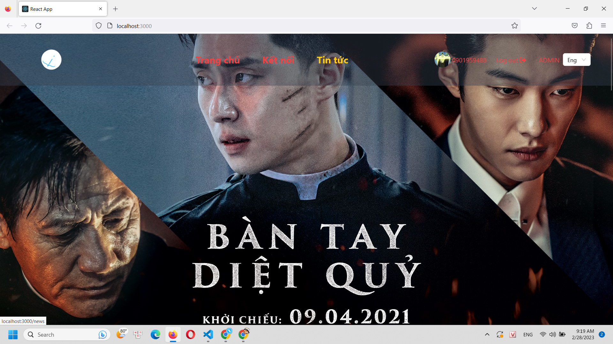

# Booking tickets project
## Project description
- Link: https://backend.cyberlearn.vn/files/19-07-2021-du-an-cuoi-khoa.pdf
## Homepages
<<<<<<< HEAD

=======
;
>>>>>>> 50ce43c557c50182a1d427b234a30c2c8bfd6deb

## The technology that I'm using in this app.
```
npm i react-router-dom: using for redirecting the webpage.;
npm i react-redux: use  to connect redux with react.;
npm i redux:  use to store the state at the global.;
npm i react-thunk: use to handle asynchronous action when it call api;
npm i lodash:  create object and function faster and using for old browser;
npm i tailwind css: style for component by class name;
npm i axios: handle asynchonous;
npm i antd: design UI faster with components in antd;
npm i emailjs: to send email to feedback for me
npm i history: a library support for react-router-dom
npm i i18net: translate content
npm i slick-carousel: create carousel
npm i yup: check validation for form
npm i sass: for sass syntax
npm i animate.css: animation for website; 
```

## build folder structures

```
src/ 
|--- assets
|    |---image: store image for the page
|    |---constant.js: store variable for javascript(fixing....)
|    |---styles: style some component from outside
|---redux: manage state of the pages
|    |--- action
|    |--- types
|    |--- reducers
|    |---configStore.js
|--- pages
|    |---StylePage: css for file in pages folder
|    |---Checkout.jsx: for booking seats and pay the money and watching the history for booking tickets
|    |---Contact.jsx: page contact 
|    |---Home.jsx: the homepage of the website;
|    |---News.jsx: the news pages(developing.....)
|    |---Profile.jsx: the profile page
|    |---Detail: --> the page for desciption of the movies and checkout for booking seats
|--- servies (connect with backend with http resquest using axios lib) 
|  
|--- component: contain component of my pages
|    |---r-slick: --> contain the multiplerow section each card in it is a Movies_flip components and css file
|    |---styleComponents: --> css for the all file in components folder
|    |---Adv: -->Components for advertising hot movies
|    |---ButtonBack: --> redirect the page to prev page 
|    |---CollapseCinema: --> responsive HomeMenu at 450 breakpoint
|    |---Movies_Flips: -->It is a card in Multilperows
|    |---Partner: -->contains infomation about new movies
|    |---ProfileMini: -->a nav with profile item, logout, admin item
|    |---Section: -->create paddingX
|    |---TitleHeader: --> create title for some components 
|    |---ModalMessage: --> create message when click button login, register, add, delete movies or users
|--- models: -->contain inital value for state in reducer
|--- template: --> contain template page help me redirect to orther page, and we also use props.params.math
|    |--- admin: contain the pages relate the admin
|    |      |---Dashboard
|    |      |---Movies: --> we can add, edit, delete movies in movies folder
|    |      |---Showtimes: --> set showtimes for the movies
|    |      |---Users: --> we can add user or delete user in here
|    |      |---AdminTemplate: --> main page in Admin to redirect another pages in AdminTemplate
|    |--- home: contain checkout template, hometemplate, usertemplate
|    |      |---CheckoutTemplate:
|    |      |---HomeTemplate
|    |      |---Layout: -->conatain header, footer of the pages
|    |      |---UserTenplate
|---translate: using for tranlate
|---utils: config domain to call api
|---App: config router
<<<<<<< HEAD
```
=======
```


>>>>>>> 50ce43c557c50182a1d427b234a30c2c8bfd6deb
